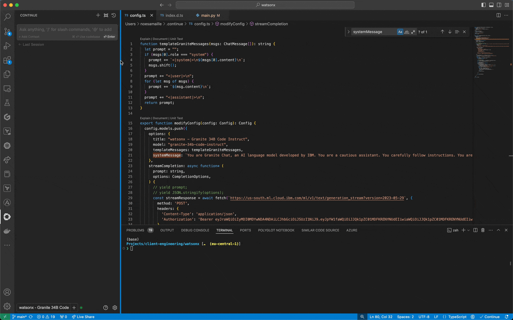

# watsonx CustomLLM definition for Continue

Simple CustomLLM definition to leverage IBM watsonx LLMs on Continue extentions.



## Get started

1. Install [Continue](https://www.continue.dev/) extension (tested with VSCode extension).
2. Make a local copy of your local Continue config:
    ```sh
    mv ~/.continue/config.ts ~/.continue/config-backup.ts
    ```
3. Copy the provided `config.ts` in `~/.continue/config.ts`:
    ```sh
    wget 
    ```
4. Replace `YOUR_WATSONX_API_KEY` and `YOUR_WATSONX_PROJECT_ID` with your IBM watsonx.ai API Key and project ID in `~/.continue/config.ts`.

## To-do

- [x] Leverage `granite-34b-code-instruct`.
- [x] Automatically update Access Token using API Key.
- [x] Create custom template for Granite.
- [ ] Create separate Chat and Completion models.
- [ ] Add support for watsonx.ai Software.
